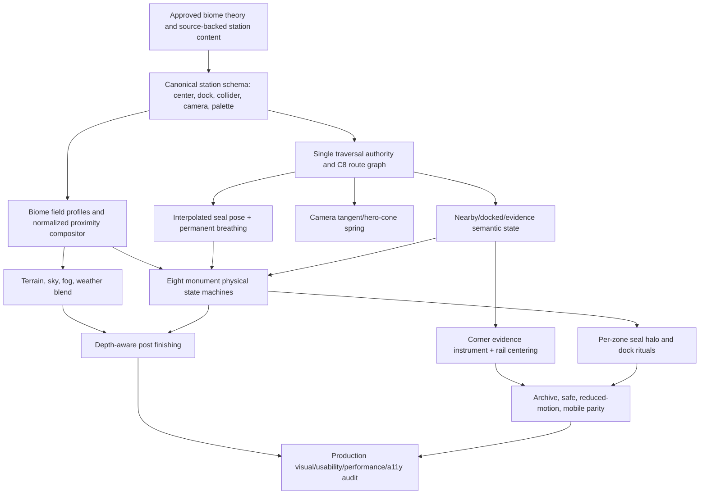

# Antarctic Biome World Theory — Approval Packet

Date: 2026-07-11
Status: **Main-approved for implementation on 2026-07-11, with the approved seal-breath timing/amplitude preserved exactly**
Scope: eight authored Antarctic micro-worlds, one continuous XZ traversal space, no production code or coordinate changes in this document pass

## 0. Decision in one sentence

Build **one seamless, bright Antarctic evidence continent** whose eight monuments sit on a closed, non-collinear traverse; every monument owns a distinct geography, procedural background field, material response, physical interaction, seal ritual, camera composition, and evidence reveal, while one canonical proximity signal blends those worlds without teleporting or replacing the scene.

This is not a request to copy Igloo Inc, Junni, Bruno, or Abeto. The references contribute principles—procedural material identity, a functional character, spatial exploration, and an in-place world stream—but the resulting geography, seal, monuments, equations, composition, and content remain original to teerthfolio.

## 1. Evidence and constraints

### 1.1 Current-state findings

- `IGLOO_ARTIFACTS` currently places the monuments at X = 0, 16, 32, 48, 64, 80, 96, and 112, with small Z offsets later multiplied by another component. That is an X rail, not an open world.
- `IglooArtifacts`, `IglooScene`, and the traversal target layer currently reinterpret station depth separately. The new traversal core is the correct place to end this ambiguity: every consumer must receive the same canonical `{x,z}` station origin and dock anchor.
- The existing `STATION_SHADER_PROFILES` already provide useful authored seeds: unique palettes, XZ angles, macro/micro scales, displacement, rim response, toon steps, and silhouette names. They should become inputs to richer per-biome fields, not be discarded.
- The existing monument silhouettes—gyroscope, nerve reactor, field cage, qubit span, signal spire, barcode vault, and tool gantry—are valid semantic beginnings. Their current generic hover/rotation behavior is not sufficient interaction.
- The approved seal silhouette and 2.4-second breathing cycle are invariants. Breathing remains additive and permanent in idle, moving, probing, docking, and safe/error states.
- The home igloo must remain the visual master. It should appear as individually constructed ice blocks without a downloaded brick texture: repeated block geometry plus shader-computed frost, mortar, transmission, and strain.

### 1.2 Reference-grounded lessons

- The local [Awwwards cumulative benchmark](./2026-07-11-awwwards-cumulative-benchmark.md) sets internal targets of 8.70 Design, 8.60 Usability, 9.10 Creativity, 8.80 Content, and 8.98 weighted Developer score. It also requires eight distinguishable silhouettes, first-10-second comprehension, source-backed evidence, and production accessibility/performance proof.
- [NSIDC's sea-ice science](https://nsidc.org/learn/parts-cryosphere/sea-ice/science-sea-ice) supports the visual vocabulary of sastrugi, pressure ridges, leads, polynyas, pancake ice, frost flowers, and blocky-to-eroded ice deformation.
- The [Australian Antarctic Program's weather overview](https://www.antarctica.gov.au/about-antarctica/weather-and-climate/weather/) explains persistent downhill katabatic wind; its [coloured-iceberg note](https://www.antarctica.gov.au/about-antarctica/ice-and-atmosphere/sea-ice/pack-ice/icebergs/coloured-icebergs/) supports blue-white and green layered ice rather than one universal cyan material.
- British Antarctic Survey material supports [ribbon-like meltwater lakes on ice shelves](https://www.bas.ac.uk/data/our-data/publication/lakes-on-george-vi-ice-shelf-antarctica/) and Antarctic [radio/auroral science](https://www.bas.ac.uk/about/education-and-schools/careers/), grounding Aether and Upstream without making the world documentary-literal.
- Three.js officially describes [`InstancedMesh`](https://threejs.org/docs/pages/InstancedMesh.html) as the mechanism for many transforms sharing geometry/material with fewer draw calls, [`PerspectiveCamera`](https://threejs.org/docs/pages/PerspectiveCamera.html) as a degree-based vertical FOV camera, and world fog as distance-based blending. These are implementation affordances, not visual compromises.

### 1.3 Three possible world structures

| Approach | Strength | Failure mode | Decision |
| --- | --- | --- | --- |
| Eight isolated showcase scenes | Maximum local art freedom | Teleporting, repeated loads, lost spatial memory, weak Bruno lesson | Reject |
| Central igloo hub with seven spokes | Easy return path and clear mental model | Repetitive backtracking; other stations remain satellites of a menu | Reject |
| **Seamless eight-biome traverse** | Continuous discovery, visible neighboring worlds, coherent seal journey, strong map memory | Requires a single coordinate/proximity authority and careful blending | **Adopt** |

## 2. Shared mathematical language

All fields use world XZ coordinates. Let `p = worldXZ - stationCenter`, `Rθ` be a 2D rotation by the station's authored angle, `N(p)` be seeded C1 value noise in `[0,1]`, and:

```text
F_k(p; s, g, l) = Σ(o=0..k-1) g^o · (2N(R_o p · s · l^o) - 1)
Ridged(p;s)      = (1 - |2N(p·s)-1|)^2
Q_n(x)           = floor(n·x + 0.5) / n
Contour(x,w)     = 1 - smoothstep(w, 2w, |fract(x)-0.5|)
```

`R_o` rotates each octave by 34 degrees to suppress axial repetition. The house macro spectrum remains four octaves, gain `g = 0.35`, lacunarity `l = 2.0`; a biome may use fewer octaves but not silently add high-frequency grime.

### 2.1 One proximity authority

For station `i`, distance `d_i = length(worldXZ - dock_i)`. Its visual proximity is:

```text
P_i = 1 - smoothstep(Rdock_i, Rfar_i, d_i)
W_i = P_i^2.2 / (0.0001 + Σ_j P_j^2.2)
```

The normalized `W_i` prevents adjacent colors from adding into mud. The nearest station owns semantic state, but neighboring worlds may remain faintly visible. Color amplification is luma-preserving:

```text
L       = dot(Czone, vec3(0.2126, 0.7152, 0.0722))
Csat    = mix(vec3(L), Czone, 0.54 + 0.46·P_i)
Cshown  = clamp(Csat · (0.96 + 0.08·P_i), 0, 1)
emissiveEnergy = 0.025 + 0.195·P_i^2
```

Thus a distant biome is readable but soft; it gains chroma, local contrast, weather coherence, and monument energy as the seal approaches. It never gains exposure by crushing the sky or snow into black.

### 2.2 Semantic hysteresis

```text
FAR       d >= Rfar
APPROACH  Rapproach < d < Rfar
ENGAGED   Rdock < d <= Rapproach
DOCKED    d <= Rdock AND speed <= 0.12 u/s for >= 0.18 s
EXIT      leave only after d > Rdock + 0.50 u
```

Selection sets `destinationId`; it does not set `activeEvidenceId`. The monument can wake during approach. Evidence becomes active only after dock or an explicit accessible “open evidence” action. No pointer click teleports the seal and no hover is the monument's primary state machine.

### 2.3 Permanent seal breathing and halo

Breathing is a pose layer, never a state replacement:

```text
breath(t) = 1 + 0.018·sin(2πt/2.4)
chestY(t) = 0.012·sin(2πt/2.4 - 0.35)
finalPose = traversalPose ⊕ functionalStatePose ⊕ breath(t)
```

The halo remains one lightweight ring mesh. Only its color, tilt target, pulse amplitude, and angular velocity change. Color cross-fades in linear light over 0.42 seconds from the current `W_i`; it never adds a point light. Reduced motion keeps the color change but freezes rotation and pulse.

## 3. Canonical map, docks, collisions, and camera cones

Coordinate convention: `+X` east, `+Z` north, Y up. Azimuth is clockwise from `+Z`. All numbers below are world units/degrees and are canonical; no later `*2.4`, `.55`, wrapping, or visual-home offset is permitted.

| Zone | Monument center XZ | Dock anchor XZ | Nearest center / spacing | Hard collision ellipse `(rx,rz,rot°)` | `Rfar / Rapproach / Rdock` | Hero camera `az / elev / vFOV` | Accepted hero view cone |
| --- | --- | --- | --- | --- | --- | --- | --- |
| Plaque / Igloo | `(-15, 7)` | `(-19.26, 8.99)` | Assembly / `9.487` | `(4.40,3.20,12)` plus entrance capsule | `10.5 / 7.0 / 2.6` | `295 / 11 / 38` | az `267–323`, elev `7–15` |
| S2 Core | `(-5, 13)` | `(-6.01, 15.61)` | Plaque / `11.662` | `(2.00,1.80,38)` | `8.5 / 5.5 / 1.8` | `339 / 14 / 36` | az `317–360 ∪ 0–1`, elev `10–18` |
| Aether | `(8, 12)` | `(9.55, 14.33)` | Field / `12.042` | `(1.80,2.35,-27)` | `8.8 / 5.8 / 1.9` | `34 / 10 / 38` | az `10–58`, elev `6–14` |
| Field | `(17, 4)` | `(20.21, 4.76)` | Aether / `12.042` | `(2.80,1.75,74)` | `9.2 / 6.2 / 2.2` | `77 / 12 / 40` | az `51–103`, elev `8–16` |
| QPU | `(15, -8)` | `(18.00, -9.60)` | Field / `12.166` | `(3.05,1.65,-48)` | `9.4 / 6.4 / 2.4` | `118 / 9 / 43` | az `88–148`, elev `5–13` |
| Upstream | `(3, -14)` | `(3.59, -16.74)` | QPU / `13.416` | `(1.75,2.15,19)` | `9.0 / 6.0 / 2.0` | `168 / 11 / 39` | az `144–192`, elev `7–15` |
| Topology | `(-11, -11)` | `(-13.47, -13.47)` | Assembly / `11.402` | `(3.10,1.55,61)` | `9.4 / 6.3 / 2.3` | `225 / 8 / 36` | az `205–245`, elev `4–12` |
| Assembly | `(-18, -2)` | `(-20.98, -2.33)` | Plaque / `9.487` | `(2.15,1.90,-9)` | `8.7 / 5.8 / 2.1` | `264 / 13 / 39` | az `240–288`, elev `9–17` |

The station centers span 35 × 27 units. The closed centerline perimeter is 97.530 units; adjacent edges are 9.487–14.318 units. Interior turn angles are 122.2–144.6 degrees, eliminating a rail-like silhouette. Even with conservative major radii, the smallest hard-shell clearance is at least 2.94 units. The camera azimuths follow the outside of the loop, so station-to-station framing rotates continuously rather than cutting to unrelated sides.

Placement also carries the portfolio story. Plaque begins in the sheltered northwest; S2 rises onto the northern pressure ridge; Aether moves into a luminous northeast ice cavity; Field reaches the exposed eastern low-sun valley; QPU crosses the southeast lead; Upstream listens from the southern coastal ridge; Topology cuts into the southwest stratified cliff; Assembly closes the loop in the western logistics yard. The content sequence is public corpus → operating system → language/manifold → physics → quantum verification → upstream collaboration → topology archive → low-level assembly/tooling → home. It progresses from orientation through abstraction and external proof back to the physical tools that built the work.

### 3.1 Guided graph

The primary graph is the closed cycle:

```text
Plaque —11.662— S2 —13.038— Aether —12.042— Field
   |                                             |
 9.487                                        12.166
   |                                             |
Assembly—11.402—Topology—14.318—Upstream—13.416—QPU
```

Guided routing uses the shorter clockwise/counter-clockwise path over a centripetal Catmull–Rom curve through the dock anchors. Manual WASD remains free in R², including the quiet central snowfield; there is no invisible corridor. Terrain recycles around the player, but monuments have one fixed logical position and never wrap. The route curve must be sampled against all collision ellipses and offset outward until clearance is at least seal radius `0.62` + shell margin `0.18`.

### 3.2 Solid collision, soft visual response

Every monument owns a hard collision shell. Penetration projects the seal to the closest ellipse/capsule boundary; inward normal velocity is removed, tangential velocity is retained at 82%, and restitution is 0.08. The seal therefore slides around a structure rather than sticking to it. Visual deformation is a separate spring driven by collision impulse and raycast proximity; it may look soft without making navigation gluey.

## 4. Eight authored biome worlds

Each subsection is an implementation contract, not mood-board language. “Texture” means an original generated field or local instance data—never a downloaded bitmap.

### 4.1 Plaque / Igloo — the proof shelter

**Narrative and geography.** Home is a wind-scoured shelf at first light: low sastrugi run past a hand-built observatory igloo, an equipment kit establishes human scale, a shallow melt ribbon bends behind it, and distant blue-ice nunataks frame the horizon. The feeling is protected, precise, and serious-cute: the seal lives here, but the place is a working research shelter rather than a toy set.

**Background shader and generated field.** With `q = R12°p`:

```text
h(q) = 0.16·F4(q;0.09,.35,2) + 0.055·Ridged(q;0.31)
     + 0.018·sin(2.4q.x + 0.65·F3(q;0.22,.35,2))
sastrugi = smoothstep(.62,.83,Ridged(vec2(q.x·.33,q.y·1.4);1))
snowAlbedo = mix(#D7EFE8,#F6F1E7, .62 + .28·sastrugi)
```

The melt ribbon is an SDF around `z = 1.15sin(.11x)+.22F3(x;.18)` with a cyan core and ivory feather; no water texture is used. Fine frost is `smoothstep(.58,.78, .78F3(local·3.8)+.22N(local·18))`, applied only to grazing/upward faces.

**Igloo construction.** Keep the current broad dome silhouette, but make its visual surface one block at a time. For dome ring `j`, latitude `φ_j = j(π/2)/(R-1)`, ring radius `r_j = r cosφ_j`, and block count `n_j = max(6, round(2πr_j / 0.56))`. Block angle is `θ_jk = 2π(k + 0.5(j mod 2))/n_j`. A rounded trapezoidal block instance is oriented to the dome normal; the door arch subtracts cells whose centers fall inside an authored arch SDF. All blocks share one instanced geometry/material, but each carries ring, seed, mass, and strain attributes. Shader-computed local block coordinates create a 0.035-unit dark-teal joint, bevel highlight, upward snow cap, internal cyan transmission, and frost grain. There is **no brick image texture and no smooth shell pretending to be bricks**.

**Mechanism and state machine.** `REST → SENSED → WEIGHTED_YIELD → RECOVER → WELCOME`. Pointer/raycast and seal collision generate a Gaussian impulse `J_j = J0 exp(-||x_j-x_hit||²/(2·0.62²))`. Each block ring has `m_j = 1 + 0.12j`, natural frequency `ω=8 rad/s`, damping ratio `ζ=.82`, `k_j=m_jω²`, and `c_j=2ζm_jω`. Maximum visible block travel is 0.045 units. Bloom/ice transmission follows spring strain, not cursor distance alone. The hard dome collider never deforms. At dock, the entrance blocks settle into a shallow 1.5-degree “welcome” cant and a warm interior slit appears; after exit they recover without a snap.

**Seal ritual.** The seal approaches along the entrance tangent, slows, makes one 6-degree head nod, and settles to the right of the arch. Breathing remains at full 2.4-second cadence. The halo cross-fades to teal `#65C1BC`, tilts to the arch plane, and pulses only once on dock. Eyes look at the door seam, then back to the visitor.

**Light, fog, weather, and palette.** Key: ivory `#F6F1E7` at azimuth 128°, elevation 24°. Fill: mint `#A7E5DF` at 32%. Rim: dawn cyan `#8FD0E0` at 46%. Fog `#B8E2DF`, local density 0.012, height falloff 0.42. Sparse snow moves at 0.22 u/s along azimuth 102°. Palette: `#F6F1E7`, `#EDF6F9`, `#D7EFE8`, `#65C1BC`, `#B9D8B1`, `#F2C98B`, ink `#33406E`.

**Evidence reveal.** Strain lines converge on the arch; the plaque rises 0.08 units and its real corpus counts resolve. A compact corner evidence instrument opens only after dock or explicit accessible action; it never covers the seal's face or central doorway. It exposes the full project index immediately, with real links and no invented telemetry.

**Motion/sound and equivalents.** Optional audio (off by default): a 108 Hz snow thump plus a short filtered 620 Hz ice ping, both under 350 ms; the halo/door pulse is the visual equivalent. Reduced motion shows all blocks already seated, freezes drift and halo rotation, retains the color/evidence transition, and replaces the nod with an eye/halo state change. Safe mode uses a bright static illustrated igloo and semantic project index. Mobile uses tap-to-route to the entrance socket and drag orbit within the 56-degree view cone; block probing is press-and-drag but never required.

### 4.2 S2 Kernel Core — closed state in a pressure-ridge amphitheatre

**Narrative and geography.** A circular pressure ridge rises from broken, sharp-edged ice blocks around a cobalt gyroscope. A pale parhelic ring in the sky echoes the closed S2 manifold. It feels mathematically complete, cold, and confident—not like a generic sci-fi planet.

**Background shader and generated field.** With `q = R38°p`, `a = atan(q.y,q.x)`, `r=length(q)`:

```text
ridgeHeight = .22·Ridged(q;.28)^1.5 + .05·F3(q;.11,.35,2)
             + .024·cos(6a + 1.7F2(q;.20,.35,2))·exp(-.08r²)
pressureEdge = 1-smoothstep(.035,.085, VoronoiEdge(q·1.35))
parhelion = exp(-abs(length(skyUV-sunUV)-.31)/.012)
            · smoothstep(-.15,.18,cos(2·atan(skyUV.y,skyUV.x)))
```

The original generated texture is a faceted pressure-block field: Voronoi cell IDs select blue-white value offsets, while edge distance supplies thin translucent seams. No rock or ice bitmap appears. Far facets are `#E2F5FF`; approach adds `#A6DFF4`; dock concentrates `#3E5BC7` only in creases, orbit traces, and the seal halo.

**Mechanism and state machine.** `DORMANT → ACQUIRE → PRECESS → STATE_LOCK → RELEASE`. The seal's approach momentum produces target angular momentum `L* = m_seal(r × v)P`. Two orthogonal gyroscope rings critically approach `L*` with `ω_n=6.2`, `ζ=.74`; they do not rotate perpetually on hover. At `P>.62`, two polar caps exchange a light bit along the great circle. Dock requires both rings to cross their proof marks within ±2.5 degrees; then the core stops for 480 ms and reveals the closed-state evidence. Exit releases stored angular momentum over 1.1 seconds.

**Seal ritual.** The seal leans 4 degrees into the precession, eyes track the moving proof bit, then returns upright at lock. Breathing is permanently superposed. Halo becomes cobalt `#3E5BC7`, rotates at one-third ring speed during approach, and stops exactly at lock.

**Light, fog, weather, and palette.** Key `#E2F5FF`, azimuth 205°, elevation 29°; fill `#8FD0E0` 28%; rim `#B9F5FF` 58%. Fog `#CDEAF5`, density .010. Small suspended frost plates move outward only when the core precesses. Palette: `#E2F5FF`, `#A6DFF4`, `#8FD0E0`, `#3E5BC7`, `#B9F5FF`, ink `#33406E`.

**Evidence reveal.** The proof marks become a compact great-circle index: Seal OS, Epsilon-Hollow, and ISO boot proof appear as three native links in the corner instrument while the physical core shows one corresponding state bit. Keyboard focus opens the same evidence without waiting for the ring animation.

**Motion/sound and equivalents.** Optional sound: phase-locked 220/330 Hz sine pair, 260 ms, with a 70 ms phase cancellation at lock. Visual equivalent: cap swap plus halo stop. Reduced motion uses three static precession poses cross-faded in 120 ms and immediately exposes the proof marks. Safe mode is a labelled S2 diagram. Mobile routing selects the dock anchor; a one-finger horizontal drag scrubs ring phase, but the dock sequence also completes automatically. Collision uses the declared ellipse and preserves tangential slide.

### 4.3 Aether / Manifold Reactor — a violet subglacial ribbon cavern

**Narrative and geography.** A fractured ice lip reveals a shallow ribbon lake beneath translucent violet ice. The reactor grows from the opening as nested nerve loops and phase beads, suggesting language neighborhoods and persistent homology without turning them into a literal graph UI. The site is quiet, luminous, and slightly uncanny.

**Background shader and generated field.** With `q=R-27°p`, define a two-channel domain warp:

```text
w(q) = q + .72·vec2(F3(q+vec2(17,3);.12,.35,2),
                    F3(q+vec2(-9,31);.12,.35,2))
cavern = -0.18·abs(F4(w;.22,.35,2)) + .055·sin(1.7w.x)
ribbonSDF = abs(q.y - .72sin(.24q.x) - .20F3(q;.18,.35,2)) - .58
nerveLines = Σ(k=0..3) exp(-95·(F3(w+s_k;.31,.35,2)-τ_k)^2)
```

`ribbonSDF<0` receives glassy cyan-violet transmission; `nerveLines` appear as narrow luminous isocontours in snow and fog. The original generated texture is a birth/death island field: four seeded scalar thresholds produce loops that merge as proximity rises. It is not a generic purple noise overlay.

**Mechanism and state machine.** `QUIESCENT → SEED → GROW_LOOPS → PERSIST → COLLAPSE`. Seven phase beads originate at separate neighborhoods. Proximity controls a deterministic filtration radius `ε=.08+.48P`; beads connect only when their world distance is below `ε`, and the nested reactor rings deform toward the resulting longest-lived cycle. At dock, exactly one cycle survives for 620 ms and becomes the evidence aperture. Exit reverses the filtration; it does not pop the meshes off.

**Seal ritual.** The seal pauses at the cavern lip, lowers its head by 5 degrees, and its eyes follow the longest-lived bead. Halo cross-fades to violet `#8D69D6`, tilts 18 degrees, and gains a slow 0.16 Hz phase pulse. Breathing remains unchanged and is visibly reflected in the lake with reduced amplitude.

**Light, fog, weather, and palette.** Key `#F0E7FF`, azimuth 246°, elevation 18°; under-ice fill `#65C1BC` at 35%; rim `#FFD7E8` at 44%. Fog `#DCCEF3`, local density .017 with a 0.26-unit ground layer. Weather is nearly still; only low vapor follows the ribbon SDF. Palette: `#F0E7FF`, `#D9C2FF`, `#8D69D6`, `#65C1BC`, `#FFD7E8`, ink `#4B4574`.

**Evidence reveal.** The persistent loop thickens into a physical aperture; the compact evidence instrument lists Aether-Lang, persistent homology, and Lean kernel work as three filtration stages. Selecting a source highlights the corresponding physical loop but does not rotate the entire building.

**Motion/sound and equivalents.** Optional sound: granular glass tones at 196/294/392 Hz whose voices disappear with collapsed loops. Visual equivalent: bead survival and aperture thickness. Reduced motion renders the final persistent cycle immediately and uses opacity only. Safe mode is a static nerve-complex diagram plus links. Mobile tap routes to the cavern lip; a vertical drag changes the filtration slider, with a native range-input equivalent in the archive.

### 4.4 Field Chamber — an amber Dry-Valley magnetic salt pan

**Narrative and geography.** The snow thins into a clean wind-polished valley floor with pale polygonal salt cells. Two Helmholtz-like coil gates span a shallow instrument trench. Low amber light makes this the warmest biome without ceasing to be Antarctic. It represents Faraday, Hamilton, fixed-point coupling, and N-body field paths.

**Background shader and generated field.** With `q=R74°p`, two virtual poles sit at `c±=(±1.8,0)`:

```text
φ(q) = log(length(q-c+)+.12) - log(length(q-c-)+.12)
B(q) = vec2(-∂φ/∂q.y, ∂φ/∂q.x)
fieldLine = 1-smoothstep(.035,.085,abs(sin(6φ + 1.6F2(q;.18,.35,2))))
saltEdge = 1-smoothstep(.025,.070,VoronoiEdge(q·.82))
h(q) = .045F3(q;.13,.35,2) - .018saltEdge
```

The original generated texture combines cream salt-cell interiors, thin amber boundaries, and directionally brushed ice aligned to normalized `B`. Field lines live primarily in the trench, fog, and glass housing; they do not cover the whole screen.

**Mechanism and state machine.** `DISCHARGED → INDUCE → POLARIZE → RESONATE → DECAY`. Seal velocity through the approach gate induces target current `I*=κ dot(v,tangent)P`; `dI/dt=(I*-I)/.18`. The paired coils move only 2.5 degrees under Lorentz-style opposing torque. Four charge gates carry visible packets along `B`; at dock and `|I|>.72`, the packets close a loop and hold for 540 ms. Evidence opens on resonance. A pointer ray may redirect one packet, but proximity/motion—not hover spin—powers the chamber.

**Seal ritual.** The seal slows before the first coil, leans with the field direction, then sits centered outside the collision ellipse. Halo becomes amber `#F4C84E`; its plane aligns with the field normal and makes one elastic 6% scale bounce at resonance. Breathing remains permanent.

**Light, fog, weather, and palette.** Key `#FFF2B2`, azimuth 282°, elevation 16°; fill `#A6D7E4` 24%; rim `#F29C46` 40%. Fog `#F3E2BC`, density .006, kept low so the coil silhouette remains crisp. Katabatic streaks move at 0.48 u/s along 74 degrees, represented by sparse salt dust and not a full particle storm. Palette: `#FFF6CE`, `#FFE37A`, `#F4C84E`, `#F29C46`, `#A6D7E4`, ink `#5A4A48`.

**Evidence reveal.** Resonant field lines flatten into a three-row physical notation strip—Faraday, Hamilton, fixed-point gauge fields—while the corner instrument exposes real project/source evidence. The strip stays readable as geometry with the DOM index available immediately.

**Motion/sound and equivalents.** Optional sound: a 180 Hz hum whose amplitude follows `|I|`, capped at 1.2 seconds, followed by a 540 Hz proof click. Visual equivalent: packet closure and halo bounce. Reduced motion shows one static closed field-line pose; safe mode uses an SVG-like field diagram and native evidence list. Mobile tap routing automatically induces a bounded current from route velocity; a two-finger gesture is never required.

### 4.5 QPU Ice Bridge — a mint sea-ice lead under coherence

**Narrative and geography.** A narrow dark-cyan lead separates two pale floes. The monument is a segmented bridge of qubit plates that exists fully only when coherence is established. Pancake-ice rims and refrozen lead edges make the place physically Antarctic; mint and cyan light keep it uplifting.

**Background shader and generated field.** With `q=R-48°p`, four seeded sources `s_k`, wave vectors `k_k`, and phases `φ_k` define:

```text
ψ(q,t) = Σ(k=0..3) a_k·exp(-||q-s_k||²/5.4)·cos(dot(k_k,q)+φ_k+.12t)
probability = clamp(ψ²,0,1)
coherenceBands = Q4(probability)
leadSDF = abs(q.y - .24sin(.31q.x) - .16F3(q;.21,.35,2)) - .46
floeCrack = 1-smoothstep(.025,.075,VoronoiEdge(q·1.1))
```

The original generated texture is a four-level interference field embedded beneath translucent ice, plus Voronoi floe cracks and raised pancake rims. It reads as a sea-ice crossing first and a quantum metaphor second.

**Mechanism and state machine.** `DECOHERENT → SAMPLE → ENTANGLE → SPAN → VERIFY → RELAX`. Five bridge plates begin at different low heights. The seal's projected progress along the dock approach activates them in order; plate `j` follows a critically damped lift when `routeArc >= j/4`. Coherence `C` is the normalized phase agreement of the four sources. At `C>.82` and dock, the plates align into one continuous span for 700 ms, a verification beam traverses it once, and evidence opens. Random spinning is forbidden.

**Seal ritual.** The seal tests the first plate with a 0.04-unit forward body shift, crosses only after the path is solid, then looks back once at the completed span. The halo becomes mint `#4BC076` with a cyan `#36D8FF` edge in the same material; it performs four discrete brightness steps while its ring geometry remains unchanged. Breathing continues through crossing and dock.

**Light, fog, weather, and palette.** Key `#E4FFF2`, azimuth 326°, elevation 20°; under-lead fill `#36D8FF` 34%; rim `#BFF4D9` 52%. Fog `#C7EFE8`, density .014, with vapor concentrated over `leadSDF<0`. Very slow frazil specks drift upward only above open water. Palette: `#E4FFF2`, `#BFF4D9`, `#4BC076`, `#36D8FF`, `#8FD0E0`, ink `#345C57`.

**Evidence reveal.** The verification beam resolves TopoBridge-Q, homology verification, IBM QPU evidence, and I/O work into four bridge joints. The corner evidence instrument preserves source links and textual meaning; the bridge is not the sole carrier of information.

**Motion/sound and equivalents.** Optional sound: four 523 Hz mallet-like envelopes detuned ±7 cents, then a 784 Hz verification tone under 240 ms. Visual equivalent: four halo steps and one beam. Reduced motion presents the bridge assembled and changes joint color sequentially without translation. Safe mode uses a static span diagram. Mobile tap route follows the bridge automatically; drag can inspect joints but cannot make the user fall or lose content.

### 4.6 Upstream Radio Mast — a coral katabatic signal ridge

**Narrative and geography.** A wind-carved ridge overlooks a coastal polynya. An asymmetric mast and dish listen to auroral and open-source signals; coral equipment paint and mint radio traces stand against a clean cyan horizon. The world feels live, but it never fabricates activity.

**Background shader and generated field.** For sky coordinates `u` and ground `q=R19°p`:

```text
auroraCenter(u,t) = .22F3(vec2(u.x·.55,t·.035);1,.35,2)
aurora = exp(-((u.y-auroraCenter)^2)/.018)
         · (.55+.45sin(9u.x+.16t+2F2(u;1.4,.35,2)))
signalFront(q,t) = exp(-22(fract(.18length(q)-.12t)-.5)^2)
katabatic = F3(vec2(q.x·.16,q.y·1.7)-vec2(.18t,0);1,.35,2)
```

The original generated texture is directionally combed snow on the ridge, circular signal fronts around the mast, and procedural auroral ribbons in the sky dome. Live API data controls only bounded pulse count/bearing metadata; visual continuity works with no network.

**Mechanism and state machine.** `LISTEN → FIND_BEARING → SYNC → RECEIVE → QUIET`. The dish target bearing is a stable hash of the returned event repository/category, not a random frame value. During approach it turns along the shortest angular path with `ω_n=5.4`, `ζ=.86`; the mast's three rings emit outward pulses only when bearing error is below 3 degrees. Dock holds one received packet, maps it to the real API identity/activity, and reveals evidence. In fallback, the state label says “research snapshot,” bearing stays at the known home direction, and no “live” pulse is claimed.

**Seal ritual.** The seal crouches 3% into the wind, ears/eyes bias toward the dish, and returns upright at receive. Halo cross-fades coral `#F47D69` while a mint `#4BC076` shader arc indicates verified reception; breathing remains permanent and slightly counter-phases the crouch so the body never freezes.

**Light, fog, weather, and palette.** Key `#FFE0D7`, azimuth 18°, elevation 17°; fill `#A7E5DF` 30%; rim `#FFB0AF` 48%. Fog `#CDE9DF`, density .011; ridge-level katabatic plumes move at 0.62 u/s. Aurora stays below 24% scene luminance so it does not become neon wallpaper. Palette: `#FFE0D7`, `#FFB0AF`, `#F47D69`, `#4BC076`, `#A7E5DF`, ink `#594C61`.

**Evidence reveal.** A received packet descends the mast into a compact radar readout containing the API-returned profile name/login and public event links for the hard-coded source handle `teerthsharma`. The panel is edge-mounted, modest in scale, and honest about fallback. It never uses the discarded giant “Live GitHub signal over the ice shelf” headline.

**Motion/sound and equivalents.** Optional sound: filtered 880 Hz radio ping over a 140 ms noise burst, only after user audio consent. Visual equivalent: dish lock, packet descent, and halo arc. Reduced motion snaps bearing with a 120 ms color transition and shows the received state; safe mode shows the semantic live/fallback list. Mobile uses a generous “route to Upstream” target and a native refresh control; dish dragging is optional inspection, not a requirement.

### 4.7 Topology Archive — a magenta stratified blue-ice wall

**Narrative and geography.** A wind-cut blue-ice cliff exposes irregular historical layers. In front, the archive monument resembles a stepped barcode wall whose bars are physical strata, not dashboard bars. Magenta marks evidence lineage while cyan-green inclusions recall naturally layered glacial and marine ice.

**Background shader and generated field.** With `q=R61°p`:

```text
warpedDepth = q.y + .65F3(q;.12,.35,2)
layerId = floor(warpedDepth/.42)
layerSeed = hash(layerId)
stratum = smoothstep(.04,.11,abs(fract(warpedDepth/.42)-.5))
barcode(q) = Σ_j rect(q.x; birth_j, death_j)·rect(q.y; jΔ, jΔ+w_j)
iceColor = mix(#B8E2DF,#F2D4E8,layerSeed)
           + barcode·(#D8478F-iceColor)
```

The original generated texture is a deterministic set of layered ice bands plus source-derived barcode lengths. Bars may encode category/count/order, but never an invented success metric. Fine bubbles are sparse seeded ellipsoids inside selected strata, not a noise film over the camera.

**Mechanism and state machine.** `INDEX → TRACE → LIFT_STRATA → OPEN_ARCHIVE → REFILE`. As proximity rises, a tracing light follows the shortest connected sequence through the physical barcode. At `P>.62`, only the bars on that trace extrude 0.04–0.16 units according to evidence depth. Dock slides two strata apart by 0.22 units to create an archive aperture; it does not rotate the wall. Selecting an evidence category in the corner instrument changes the traced path and bar depths. Exit refiles in reverse order with 45 ms stagger.

**Seal ritual.** The seal walks parallel to the strata for 0.55 seconds, eyes scanning left-to-right, then turns 9 degrees toward the aperture. Halo becomes magenta `#D8478F`, inclines with the dominant stratum at 61 degrees, and uses five brightness steps matching the current topology category. Breathing remains unchanged.

**Light, fog, weather, and palette.** Key `#FFF0F7`, azimuth 64°, elevation 22°; blue-ice fill `#B8E2DF` 34%; rim `#D8478F` 36%. Fog `#E4D7E6`, density .009, with horizontal laminar drift at 0.18 u/s. Palette: `#FFF0F7`, `#F2D4E8`, `#D8478F`, `#8D69D6`, `#B8E2DF`, ink `#61445F`.

**Evidence reveal.** The aperture exposes lambda-topo, topoflow, topoml, phi-mem, visualization, and phase-memory evidence in a compact Gregory-style index. Active category remains anchored; opening detail never destroys the full scan list. Each bar has an accessible text counterpart and source link.

**Motion/sound and equivalents.** Optional sound: dry 247 Hz ticks with pitch proportional to bar depth, capped at five ticks per transition. Visual equivalent: trace light and ordered extrusion. Reduced motion changes bar color without depth animation and opens the index immediately. Safe mode is the complete archive list. Mobile uses a stacked focused index; swipe changes category but native previous/next buttons remain available.

### 4.8 Assembly Vault — a steel-and-peach coastal logistics yard

**Narrative and geography.** The loop ends at a clean coastal field workshop: low snow berms, an ice runway line, a forked tool gantry, and a recessed assembly table. Steel, peach sunrise, and restrained teal instrumentation replace dark industrial grime. It represents AVX-512, page tables, `no_std`, bare metal, stencils, and SIMD topology.

**Background shader and generated field.** With `q=R-9°p`:

```text
grid(q) = max(Contour(q.x·.36,.025), Contour(q.y·.36,.025))
toolPath = exp(-82·(F3(q;.20,.35,2)-.50)^2)
           · smoothstep(-.2,.2,sin(1.7q.x+.9q.y))
knurl(q) = .5+.5sin(18(q.x+q.y))·sin(18(q.x-q.y))
h(q) = .052F3(q;.10,.35,2) + .012grid(q)
```

The original generated texture is a clean machined/knurled anisotropy on metal parts, frost accumulated only on upward faces, and an ice-runway stencil computed from SDF lines. No rust, dirty concrete, or full-screen binary texture is allowed.

**Mechanism and state machine.** `STOWED → INDEX_PARTS → ASSEMBLE → PROVE → RESET`. Four physical component groups correspond to AVX, paging, `no_std`, and stencil/SIMD. Approach indexes them by moving small locator pins, not the whole monument. Dock starts a deterministic assembly: two gantry arms translate/rotate components into a central typed socket, one at a time, using critically damped springs (`ω_n=7.0`, `ζ=.88`). The proof state occurs only when all socket orientation errors are under 1.5 degrees and translation errors under 0.025 units. Evidence opens; exit disassembles in reverse. Pointer input can pause/scrub the sequence but cannot fling parts.

**Seal ritual.** The seal places its nose over the start locator, makes one 0.03-unit “inspect” lean, then sits outside the gantry sweep. Halo becomes steel-blue `#73809E` with a peach `#F2C98B` strain highlight; it makes one restrained 4% vertical bounce when proof locks. Breathing remains permanent.

**Light, fog, weather, and palette.** Key `#F3F6F8`, azimuth 112°, elevation 25°; peach fill `#F2C98B` 28%; teal rim `#65C1BC` 34%. Fog `#DDE7E7`, density .008. Narrow spindrift streaks follow the runway at 0.34 u/s, stopping visually at berms. Palette: `#F3F6F8`, `#DDE4E9`, `#73809E`, `#F2C98B`, `#65C1BC`, ink `#3F465C`.

**Evidence reveal.** Each proved part becomes one row in a compact assembly manifest with source, role, result, and evidence. The manifest stays in a screen corner and can expand into the complete archive. The central socket retains the physical state corresponding to the focused row.

**Motion/sound and equivalents.** Optional sound: a muted 120 Hz mechanical seat plus 240 Hz proof click, total under 320 ms. Visual equivalent: locator pins, seated part, halo bounce. Reduced motion presents a completed exploded view with instant row focus; safe mode uses a semantic assembly manifest. Mobile runs the deterministic assembly after dock and offers native step-back/step-forward buttons rather than precision dragging.

## 5. World composition rules that apply to every biome

### 5.1 Background compositor

The scene has one sky, one recyclable terrain system, and one local-biome compositor—not eight mounted background planes. At each frame, evaluate only the nearest two biome weights for terrain/sky/fog uniforms. The active biome may add bounded local geometry (ridge, lead, wall, melt ribbon), but it cannot replace the world or erase a neighboring silhouette. At least one previous or next monument should remain as a distant landmark whenever the view cone permits.

The hierarchy in a HUD-hidden still is:

1. monument silhouette and contact;
2. local Antarctic geography;
3. seal and halo;
4. approach path/weather response;
5. evidence micro-detail;
6. post effects.

Chromatic aberration, dithering, quantization, scanlines, vignette, fisheye, depth pixelation, and edge ink remain finishing layers. None may supply the missing silhouette, material separation, or biome identity.

### 5.2 Camera continuity

During travel, the camera follows the interpolated seal pose and route tangent. On entering `APPROACH`, it blends toward the station's hero azimuth/elevation/FOV over proximity range `P=.18→.72` using a critically damped spring; it never sets position directly. At dock it must end inside the tabled view cone. Reverse-route arrival mirrors the tangent bias but converges to the same hero composition. On portrait/mobile, add 7 degrees to vertical FOV, multiply distance by 1.18, and shift the look target up by 0.12 units; do not crop the monument into a face-filling blob.

### 5.3 Evidence instrument

The evidence UI is a controlled project index, not a center-screen card. Desktop default: lower-left or lower-right corner opposite the seal, width `clamp(17rem,24vw,25rem)`, maximum height 46vh, 16 px safe-area inset. Mobile: bottom sheet at 42vh collapsed / 76vh expanded with a persistent close and archive link. It must use native links/buttons, visible focus, and an `aria-live="polite"` arrival status. The full archive remains reachable from the first viewport without learning WASD.

### 5.4 Weather and sound

Only the nearest biome's weather is dynamic above 20% opacity. The second-nearest may contribute color/horizon form but no additional particle system. Audio is opt-in, never autoplays, and all sonic information has a synchronized visual state. Page visibility pauses simulation-time sound and weather; resuming cannot fast-forward accumulated time.

## 6. Cumulative first-ten-seconds choreography

This is an in-place world stream, not a document reveal and not a blocking logo animation.

| Time | Visual/system event | Information carried |
| ---: | --- | --- |
| `0.00–0.22s` | Polar horizon, fog color, and low terrain silhouette appear immediately; static fallback markup already exists beneath/alongside canvas. | “This is a bright Antarctic place,” even before shaders compile. |
| `0.18–0.62s` | Sastrugi, melt ribbon, and distant nunataks resolve from low to authored detail. | Scale and geography before HUD. |
| `0.42–1.45s` | Igloo blocks seat ring-by-ring from foundation to crown with 34 ms ring stagger; entrance remains the focal negative space. | The hero is built from mathematical blocks, not a texture. |
| `0.72–1.62s` | Topological seal resolves beside the entrance; first breath is already in progress, eyes blink once at `1.34s`. | A functional companion lives here. |
| `1.10–1.82s` | Teal halo fades in and aligns to the Plaque biome; no point-light flash. | Current place/state is legible. |
| `1.45–2.30s` | One real source-backed evidence signal appears at the screen edge; name/title and Work/Archive/Contact settle into corners. | Who, what, and proof without covering the world. |
| `2.10–3.10s` | The door seam breathes with the seal; the world performs a 1.8-degree camera parallax, not an orbit. | Physical continuity and depth. |
| `3.00–4.20s` | S2 pressure ridge becomes faintly visible northeast; one route segment brightens from Plaque toward it. | There is somewhere to explore. |
| `4.20–5.40s` | A compact “WASD / arrows / choose a station” onboarding cue appears; it disappears on any input and never repeats. | Controls are learned within ten seconds. |
| `5.40–6.80s` | If idle, the seal looks toward S2 and the halo tilts 4 degrees in that direction; if moving, normal traversal begins with no canned wait. | Mascot teaches direction through pose. |
| `6.80–10.00s` | If idle, the S2 parhelic ring makes one low-amplitude pulse; if moving, Plaque color softens and S2 cobalt grows continuously with proximity. | The site demonstrates the biome-blend cause/effect. |

After onboarding, exploration hints run only after 15 seconds without meaningful input, remain visible for 3.2 seconds, use nearest-undiscovered graph distance, and say “signal left” or “signal right.” They do not steal focus, queue speech bubbles, or fire while the user is moving.

Reduced motion begins with the completed `1.82s` composition, then reveals the same evidence/control cues without spatial assembly. Safe mode renders the same hierarchy as a static illustration plus index. Neither path waits ten seconds for content.

## 7. Implementation dependency graph (for later planning only)



Required order:

1. Approve this theory and freeze the station schema.
2. Complete and verify the single traversal authority; remove all secondary coordinate multipliers and pose filters.
3. Apply centers, docks, colliders, and C8 route; verify Plaque return before art expansion.
4. Implement the normalized biome compositor and camera cones.
5. Build the home igloo and its weighted interaction as the visual quality reference.
6. Build each monument mechanism against the same state interface; do not create seven unrelated input systems.
7. Connect seal halo/ritual and evidence semantics.
8. Add post finishing only after HUD-hidden screenshots pass.
9. Produce desktop/mobile/reduced/safe production evidence and then optimize without changing the visual contract.

## 8. Measurable Awwwards and product gates

### 8.1 Design

- HUD-hidden captures at all eight docks must make the monument and Antarctic geography recognizable; 4/5 blind viewers must identify “Antarctic research world” in the first frame.
- In grayscale silhouette cards, 4/5 viewers distinguish all eight monuments; in color cards, 4/5 correctly match at least six biomes to their stations.
- Every station capture stays inside its exact view cone, shows contact shadow rather than a flat black oval, and includes no clipped hero geometry, black void, stretched field, shader seam, or evidence panel over the seal's eyes.
- Adjacent stations may share ivory/cyan environmental continuity, but each must differ in geography, field equation, mechanism, hero hue, and evidence reveal. Hue-only variation fails.
- Plaque/Igloo is the detail ceiling: individually readable blocks, stable entrance silhouette, visible scale anchor, and a still frame stronger than every non-home station.

### 8.2 Usability and motion

- 4/5 unfamiliar users discover movement or station routing within ten seconds without verbal coaching.
- Click/tap routing traverses the C8 graph and never changes position by more than the fixed controller's documented per-frame bound.
- Destination, nearby, docked, evidence, rail, halo, monument, and camera state agree in 100% of recorded route transitions.
- Returning from Assembly or S2 to Plaque restores the same igloo origin, collision, door, seal home ritual, teal halo, and evidence—no wrapped copy and no remount blank.
- Collision traces show zero penetrations beyond 0.02 units and zero “glued” intervals over 120 ms while tangential input remains nonzero.
- Breathing amplitude/frequency remains present in frame samples for every functional seal state and all eight stations.

### 8.3 Creativity and content

- Blind reviewers describe the ownable idea as “a seal-guided Antarctic evidence continent” rather than an Igloo/Junni/Bruno copy in at least 4/5 responses.
- Each monument passes a five-part identity audit: unique physical function, shader field, geography, arrival ritual, and evidence mapping.
- All evidence rows contain a concrete work name, role/claim, result or technical point, and source URL; link audit finds zero knowingly fabricated events or broken first-party routes.
- Upstream presents API-returned identity/activity for `teerthsharma` and visibly labels the research-snapshot fallback.

### 8.4 Developer and accessibility

- Target the benchmark's internal main score `>=8.77` and synthetic developer score `>=8.98`, with every category floor passed independently.
- Production run: zero uncaught page errors, shader compile/link errors, hydration errors, context losses, or failed first-party requests.
- Desktop p95 settled frame time `<=16.7ms`, travel `<=20ms`; mobile adaptive quality must reduce weather/post/secondary geometry before traversal continuity. Visual optimization may occur after the master pass, but these remain release gates.
- Lighthouse mobile median of three cold runs: LCP `<=2.5s`, INP `<=200ms`, CLS `<=0.10`, Accessibility/SEO/Best Practices `>=95` on documented hardware/network.
- `axe`: zero serious/critical findings. Keyboard, screen reader, 200% zoom, forced colors, reduced motion, touch, safe mode, and archive fallback all complete the core evidence task.
- Every tap target is at least 44 × 44 CSS px; portrait/landscape 320–2560 px have no accidental document overflow or unreachable station/index.
- Ten-minute eight-station soak shows no monotonic geometry/material/texture growth after warm-up and no repeated long-task storm.

## 9. Non-negotiable anti-patterns

- No X-only rail, hidden Z multiplier, station wrapping, visual-home duplicate, or coordinate reinterpretation downstream.
- No teleport on rail/card click and no semantic evidence activation before arrival.
- No monument whose only interaction is pointer hover, whole-object spin, scale pulse, or click.
- No downloaded biome/brick texture and no copied Igloo Inc asset, shader, layout, or model. Attribution does not make copying original.
- No one generic full-screen noise field recolored eight ways.
- No stopping the seal's breath during movement, docking, non-home stations, error, or safe fallback.
- No “soft” visual deformation coupled to the hard collision shell.
- No giant center card, text wall, fake live telemetry, audio autoplay, or canvas-only evidence.
- No fog/bloom/chromatic aberration used to hide weak form, contact, material, or camera composition.

## 10. Main-agent approval checklist

Main review completed on 2026-07-11:

- [x] Approve the seamless eight-biome traverse over isolated scenes or a hub/spoke model.
- [x] Approve the exact monument centers and dock anchors in Section 3.
- [x] Approve the closed C8 guided graph, with manual free movement through the center.
- [x] Approve the collision ellipses/entrance capsule and hard-shell/soft-response separation.
- [x] Approve normalized two-nearest biome blending and the shared proximity/hysteresis equations.
- [x] Approve the exact camera azimuth/elevation/FOV cones.
- [x] Approve each biome's geography, palette, shader/generated field, and non-click mechanism.
- [x] Approve permanent seal breathing and a single station-colored halo ring.
- [x] Approve the first-ten-second choreography and 15-second later hint cadence.
- [x] Approve the corner evidence instrument and mobile/reduced/safe equivalents.
- [x] Approve the implementation dependency order and release gates.

**Approved revision:** the current user-approved breath implementation remains the source of truth: `sin(time * 2.6) * 0.014` (approximately a 2.42-second period at 1.4% scale amplitude). Biome or functional state work may add pose layers, but must not retune, gate, or replace that breath.

**IMPLEMENTATION AUTHORIZED:** the theory pass made no production changes. Production application may now begin in the dependency order above, with contract tests guarding the canonical XZ schema and the breath invariant.

## 11. Self-review

- Placeholder scan: no TBD/TODO values remain.
- Internal consistency: all eight station IDs, palettes, centers, dock anchors, collision footprints, radii, camera cones, mechanisms, rituals, and fallbacks are specified once and use the same coordinate/proximity convention.
- Scope: this is one world-system specification; implementation is explicitly decomposed and deferred.
- Ambiguity removed: station centers are monument origins, dock anchors are traversal goals, `dockedId` gates evidence, and visual deformation never changes collision.
- Originality: Antarctic source material grounds the geography, while all equations, compositions, generated fields, and interaction mappings are a teerthfolio-specific synthesis.
